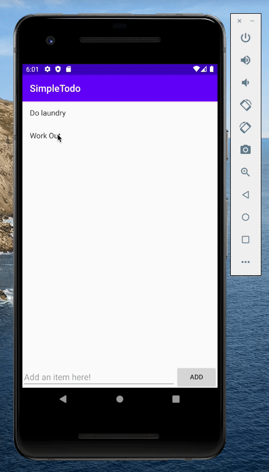
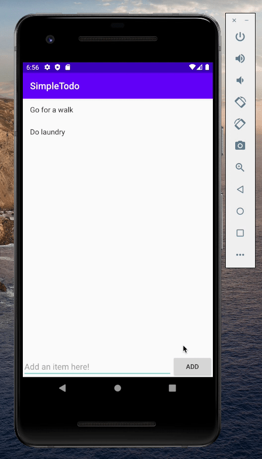

# Project 1 - _SimpleTodo_

**SimpleTodo** is an android app that allows building a todo list and basic todo items management functionality including adding new items, editing and deleting an existing item.

Submitted by: **Isaac Berman**

Time spent: **5** hours spent in total

## User Stories

The following **required** functionality is completed:

- [x] User can **view a list of todo items**
- [x] User can **successfully add and remove items** from the todo list
- [x] User's **list of items persisted** upon modification and and retrieved properly on app restart

The following **stretch** features are implemented:

- [x] User can **tap a todo item in the list and bring up an edit screen for the todo item** and then have any changes to the text reflected in the todo list

The following **additional** features are implemented:

- [x] Refactored repeated code into the `saveChanges()` method
- [x] User receives an **alert dialog to stop them from accidentally deleting an item** from the todo list
- [x] User **cannot add an empty item** to the list and will receive a helpful message when trying to do so

## Video Walkthrough

Here's a walkthrough of all implemented user stories:

Feature specific walkthroughs:

User can **view a list of todo items**

User can **successfully add and remove items** from the todo list

User's **list of items persisted** upon modification and and retrieved properly on app restart

User can **tap a todo item in the list and bring up an edit screen for the todo item** and then have any changes to the text reflected in the todo list

User receives an **alert dialog to stop them from accidentally deleting an item** from the todo list

User **cannot add an empty item** to the list and will receive a helpful message when trying to do

GIFs created with [Kap](https://getkap.co/).

## Notes

Here are some various issues and challenges I encountered while building the app.

- Git couldn't be installed manually due to a network error, I had to download a packaged version
- The simulator wouldn't start until I approved through the Santa system
- The `FileUtils` module was being imported incorrectly. Android Studio automatically imported a built-in class called FileUtils when I needed to import the one from Apache Commons. I couldn't figure out why the `readLines()` function could not be found until I realized that Android Studio imported the wrong class.
- I had to search the [Android documentation](https://developer.android.com/guide/topics/ui/dialogs#java) for the right information in order to implement the Alert Dialog feature.

## License

    Copyright [yyyy] [name of copyright owner]

    Licensed under the Apache License, Version 2.0 (the "License");
    you may not use this file except in compliance with the License.
    You may obtain a copy of the License at

        http://www.apache.org/licenses/LICENSE-2.0

    Unless required by applicable law or agreed to in writing, software
    distributed under the License is distributed on an "AS IS" BASIS,
    WITHOUT WARRANTIES OR CONDITIONS OF ANY KIND, either express or implied.
    See the License for the specific language governing permissions and
    limitations under the License.
